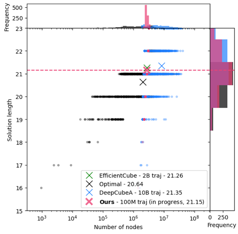

This repo contains code for training and evaluating diffusion models for pathfinding on Cayley graphs. The simplest cases are the general permutation group, and the 2x2x2 and 3x3x3 cube groups. This is the repository attached to the paper "Diffusion Models for Cayley Graphs" (upcoming, ADV. THEOR. MATH. PHYS. 2025).

# Settings:

*The Rubik's Cube* - you know what it is!

*The Andrews-Curtis conjecture*
The Andrews-Curtis conjecture is a major open problem in combinatorial group theory. A group presentation is typically written $\langle x_1,\cdots, x_n\;|\;r_1(x_i),\cdots,r_n(x_i)\rangle$, where $r_k(x)$ is equal to the identity (e.g. $\mathbb{Z}_2 \times \mathbb{Z}_2  = \langle x_1,x_2\;|\; x_1^2 x_2^2\rangle$). The conjecture states that any balanced (equal number of generators $x_i$ and relators $r_i$) presentation of the trivial group can be transformed into the empty presentation using only Andrews-Curtis moves.   

The Andrews-Curtis moves are:

 1. Replace $r_i$ with $r_i^{-1}$
 2. Replace $r_i$ with $r_i * r_j$ where $i ≠ j$
3.  Replace $r_i$ with $g * r_i * g^{-1}$ where g is a generator

A presentation is balanced if it has the same number of relators as generators. The conjecture has been open since 1965, and is considered one of the most important problems in combinatorial group theory. It is closely related to the 4-dimensional smooth Poincaré conjecture.

The conjecture is widely believed to be false, and there are many potential counterexamples. The most famous are the Akbulut-Kirby presentations AK(n). These are presentations of the trivial group which seem to get harder to trivialize as n increases. No one has been able to show that $AK(3)$ can be trivialized using Andrews-Curtis moves, despite it being provably trivial by other means.

The difficulty is that the space of possible move sequences grows exponentially, and there's no known way to systematically search it. This makes it a natural target for machine learning approaches.

# Pathfinding on Cayley graphs using diffusion models


In the past, people have proposed learning the inverse of scrambling trajectories from the solved state solve the Rubik's cube. We simply propose taking that idea  seriously, and thereby consider the problem as a diffusion modelling exercise. The scrambling defines a forward diffusion process starting from the solved configuration, which is a time-homogeneous discrete-time Markov chain. It has an inverse which can be written analytically and is also a Markov chain, but time-inhomogeneous. If the transition kernel for the forward process is $q_t(x_{t+1}|x_t)=q(x_{t+1}|x_t)$ then the transition kernel for the inverse process is $r_t(x_{t-1}|x_t)=q(x_t|x_{t-1})\frac{p_{t-1}(x_{t-1})}{p_t(x_t)}$ where $p_t$ is the distribution from the forward process at time $t$.

Minimising a suitable choice of score-matching objective (a Bregman divergence), the model learns the inverse of the scrambling process. Running the inverse diffusive process, in principle we solve the pathfinding problem. Placing this scrambling process on a firm mathematical foundation enables us to see how to rigorously improve the forward process! 

Our method is considerably more sample efficient (by more than an order of magnitude) than the previous best method, EfficientCube, and more performant at the same beam width. EfficientCube uses a neural network to directly predict the inverse of each scrambling move. Considering the long-time limit of the scrambling process training EfficientCube, one can easily see that it becomes problematic: if one were to train with $T$ to $\infty$, just learning the inverse of each scrambling move would be meaningless, as the stationary distribution after time $T$ would be the uniform distribution. Instead learning the inverse of the diffusive process, the network can able to distinguish between  early and late stages. Theoretically, therefore, we *remove* a hyperparameter from the training process, as we could use any $T$ that is sufficiently large. In practice, of course, we need to train with a finite $T$, but this is still a significant improvement.

For the same beam width of $2^18$, we achieve an average solution length (on a list of 1000 hard configurations) of $22.15$, vs $22.26$ in EfficientCube. We achieve this after seeing just 100 million configurations.



# Applications to the Andrews-Curtis conjecture (*in progress*)


We can apply the same methods to the Andrews-Curtis conjecture. Starting with a presentation of the trivial group, apply random Andrews-Curtis moves of type AC1' and AC2' (see https://arxiv.org/abs/2408.15332). Then learn to invert this diffusive process.


We restrict to balanced presentations with two relators and two generators.

We are able to trivialise $AK(2)$ using this method. We are not able to trivialise $AK(3)$, so far. $AK(3)$ is the first element in the Akbulut-Kirby series which is not known to be trivial (or, indeed, stably trivial).

We can also *improve* the forward diffusive process, by training it to explore the search space using reinforcement learning or simply deterministically modifying the diffusive process. I have implemented a variety of training objectives to reward exploration, including a diversity bonus, complexity bonus, entropy selection, penalty for not using moves, etc. This is a work in progress.

# NN models implemented:

- `FF_residual_model`: A feedforward residual network with a time embedding.
- `Transformer_model`: A transformer model with a time embedding.

# Beam search

`heuristic_searches.py` contains an efficient implementation of beam search, with preallocation of memory for the beam tensors. It represents a 10x speeup over other implementations for the Rubik's cube.


# Other groups
The code is designed to be modular, so that it can be easily extended to other groups.

The main files are:

- `envsAndScramble.py`: contains the environment definitions and scrambling functions for the cube groups.
- `NN_models.py`: contains the definition of the neural network models.
- `cube_training.py`: contains the training loop for the cube groups.
- `heuristic_searches.py`: contains the heuristic search methods.


# Troubleshoot:

Ensure you install the correct version of torch-scatter.
```
pip install torch-scatter -f https://data.pyg.org/whl/torch-{torch.__version__}.html
```

Ensure you have installed wandb, pytorch_optimizer, and tqdm.

# Credit
Rubik's cube environment, and statistical comparison data taken from EfficientCube by K. Takano.

# MIT License

Copyright (c) 2024

Permission is hereby granted, free of charge, to any person obtaining a copy
of this software and associated documentation files (the "Software"), to deal
in the Software without restriction, including without limitation the rights
to use, copy, modify, merge, publish, distribute, sublicense, and/or sell
copies of the Software, and to permit persons to whom the Software is
furnished to do so, subject to the following conditions:

The above copyright notice and this permission notice shall be included in all
copies or substantial portions of the Software.

THE SOFTWARE IS PROVIDED "AS IS", WITHOUT WARRANTY OF ANY KIND, EXPRESS OR
IMPLIED, INCLUDING BUT NOT LIMITED TO THE WARRANTIES OF MERCHANTABILITY,
FITNESS FOR A PARTICULAR PURPOSE AND NONINFRINGEMENT. IN NO EVENT SHALL THE
AUTHORS OR COPYRIGHT HOLDERS BE LIABLE FOR ANY CLAIM, DAMAGES OR OTHER
LIABILITY, WHETHER IN AN ACTION OF CONTRACT, TORT OR OTHERWISE, ARISING FROM,
OUT OF OR IN CONNECTION WITH THE SOFTWARE OR THE USE OR OTHER DEALINGS IN THE
SOFTWARE.
